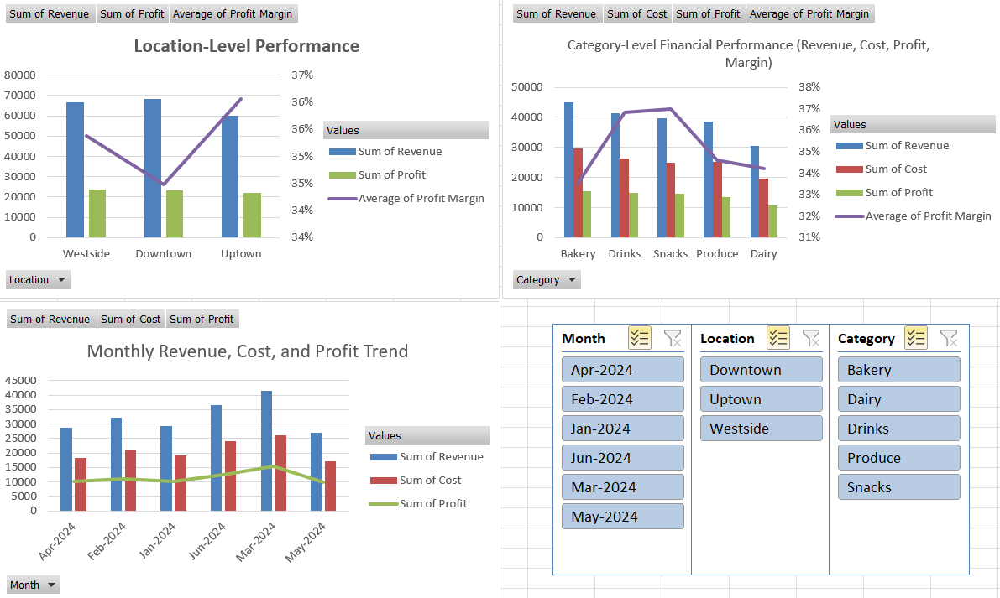

# 🛍️ Retail Profitability Analysis Dashboard

This project presents a comprehensive analysis of a retail dataset using Excel PivotTables and PivotCharts. The goal is to uncover key performance trends by **product category**, **store location**, and **month** to support data-driven business decisions.

## 📂 Project Objective

To build an interactive Excel dashboard that highlights revenue, cost, profit, and profit margin trends across different categories and store locations — enabling retail managers to:

- Identify top- and low-performing products
- Optimize store-level profitability
- Make informed, actionable decisions based on visual data analysis

## 📊 Dashboard Overview

The Excel dashboard includes three key views:

1. **Monthly Revenue, Cost, and Profit Trend**  
   Stacked Column Chart (Revenue & Cost) + Profit Line

2. **Category-Level Financial Performance**  
   Clustered Columns (Revenue, Cost, Profit) + Line for Avg. Profit Margin

3. **Location-Level Performance**  
   Clustered Columns (Revenue, Profit) + Line for Avg. Profit Margin

Interactive slicers for:
- Month
- Category
- Location

## 🔍 Key Insights

- **Monthly Trends**:
  - Revenue and profit peaked in **March 2024**, followed by a significant dip in **May 2024**.

- **Category-Level Insights**:
  - **Bakery** had the highest total profit ($15,354.54).
  - **Snacks** and **Drinks** had the highest average profit margin (37%).
  - **Dairy** had the lowest performance (profit: $10,656.16, margin: 34%).

- **Location-Level Insights**:
  - **Downtown** had the highest revenue ($68,135.77).
  - **Uptown** had the highest average profit margin (36%).

## 📸 Dashboard Preview

## ✅ Recommendations

- Increase stock and promotions for **Snacks** and **Drinks** due to strong margins.
- Investigate low performance in **Dairy** to improve profitability.
- Analyze **March 2024** to replicate successful drivers in future months.
- Combine **Downtown's** revenue strategy with **Uptown's** margin efficiency.
- Use slicers for drill-down analysis by time, category, or location.

## 📁 Tools Used

- Microsoft Excel
- PivotTables
- PivotCharts
- Slicers

## 🧠 Skills Demonstrated

- Data Analysis & Cleaning
- Dashboard Design
- Business Insight Generation
- Data Storytelling

